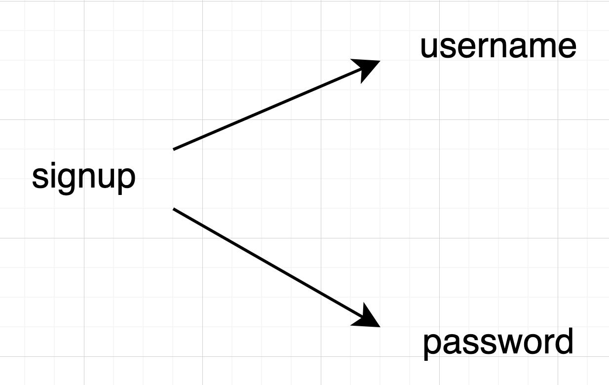

# Aggregate form data

## Gather your FormControls

From the last article, we introduced the signup form, which takes two FormControls for two `TextInput`s, and it functions basically.

```jsx live
function SignupExample() {
  const [result, setResult] = useState('');

  const username = useTextInput(
    stringField()
      .required('This field cannot be empty. ')
  );
  const password = useTextInput(
    stringField()
      .min(6, 'This password is too short. ')
  );

  return (
    <div>
      <TextInput control={username} placeholder="Username" />
      <ErrorMessage control={username} />
      <br />
      <TextInput control={password} placeholder="Password" />
      <ErrorMessage control={password} />
      <br />
      <button
        onClick={() => setResult(JSON.stringify({
          username: username.getOutput(),
          password: password.getOutput(),
        }))}
      >
        Submit
      </button>
      <br />
      Result:
      {' '}
      {result || '-'}
    </div>
  );
}
```

Note that we use the following expression to aggregate the output we want:

```jsx
{
  username: username.getOutput(),
  password: password.getOutput(),
}
```

which, well, might work when we only have one or two fields, but it doesn't scale when we have a dozen of `FormControl`s.

To wrap the growing count of FormControl, we can wrap with a newly introduced `StructFormControl`, which is managed by `useStruct`:

```jsx
import { useState } from 'react';

import { ErrorMessage, TextInput, textInput, useStruct } from '@monoid-dev/reform/react'
import { stringField } from '@monoid-dev/reform';

export default function SignupExample() {
  const [result, setResult] = useState('');

  const signup = useStruct({
    username: textInput(
      stringField()
        .required('This field cannot be empty. ')
    ),
    password: textInput(
      stringField()
        .min(6, 'This password is too short. ')
    ),
  });

  return (
    <div>
      <TextInput control={signup.controls.username} placeholder="Username" />
      <ErrorMessage control={signup.controls.username} />
      <br />
      <TextInput control={signup.controls.password} placeholder="Password" />
      <ErrorMessage control={signup.controls.password} />
      <br />
      <button
        onClick={() => setResult(JSON.stringify(signup.getOutput()))}
      >
        Submit
      </button>
      <br />
      Result:
      {' '}
      {result || '-'}
    </div>
  );
}
```

```jsx live
function SignupExample() {
  const [result, setResult] = useState('');

  const signup = useStruct({
    username: textInput(
      stringField()
        .required('This field cannot be empty. ')
    ),
    password: textInput(
      stringField()
        .min(6, 'This password is too short. ')
    ),
  });

  return (
    <div>
      <TextInput control={signup.controls.username} placeholder="Username" />
      <ErrorMessage control={signup.controls.username} />
      <br />
      <TextInput control={signup.controls.password} placeholder="Password" />
      <ErrorMessage control={signup.controls.password} />
      <br />
      <button
        onClick={() => setResult(JSON.stringify(signup.getOutput()))}
      >
        Submit
      </button>
      <br />
      Result:
      {' '}
      {result || '-'}
    </div>
  );
}
```

Here, we use `useStruct` that takes a mapping of field name to its `FormControl`, instead of declaring both `FormControl` of `username` and `password` respectively. We don't write much extra code, because we also need to denote the name when using `const formControlName = useTextInput(stringField())`, but the benefit is clear:

```jsx
form.getOutput()
```

This simple method call returns the output of the form value. No need to call `getOutput()` from each `FormControl` one by one.

## Cross field validation

The use of `StructFormControl` returned by `useStruct` does not stop here. It provides us with a chance to manage its child FormControl as a whole.



With more information at hand, we can validate single fields against output from other fields. For example, we want to ask the user to repeat the new password before submission:

```jsx
import { useState } from 'react';

import { ErrorMessage, TextInput, useTextInput, useStruct } from '@monoid-dev/reform/react'
import { makeLeft, makeRight, stringField } from '@monoid-dev/reform';

export default function SignupExample() {
  const [result, setResult] = useState('');

  const signup = useStruct({
    username: textInput(
      stringField()
        .required('This field cannot be empty. ')
    ),
    password: textInput(
      stringField()
        .min(6, 'This password is too short. ')
    ),
    repeatPassword: textInput(
      stringField()
    ),
  },
    (o) => o.password === o.repeatPassword ? makeRight(o) : makeLeft({ message: 'Passwords don\'t match. ' })
  );

  return (
    <div>
      <TextInput control={signup.controls.username} placeholder="Username" />
      <ErrorMessage control={signup.controls.username} />
      <br />
      <TextInput control={signup.controls.password} placeholder="Password" />
      <ErrorMessage control={signup.controls.password} />
      <br />
      <TextInput control={signup.controls.repeatPassword} placeholder="Password" />
      <ErrorMessage control={signup.controls.repeatPassword} />
      <br />
      <button
        onClick={() => setResult(JSON.stringify(signup.getOutput()))}
      >
        Submit
      </button>
      <br />
      <ErrorMessage control={signup} />

      <br />
      Result:
      {' '}
      {result || '-'}
    </div>
  );
}
```

<details>
<summary>Live Editor</summary>
<p>

```jsx live
function SignupExample() {
  const [result, setResult] = useState('');

  const signup = useStruct({
    username: textInput(
      stringField()
        .required('This field cannot be empty. ')
    ),
    password: textInput(
      stringField()
        .min(6, 'This password is too short. ')
    ),
    repeatPassword: textInput(
      stringField()
    ),
  },
    (o) => o.password === o.repeatPassword ? makeRight(o) : makeLeft({ message: 'Passwords don\'t match. ' })
  );

  return (
    <div>
      <TextInput control={signup.controls.username} placeholder="Username" />
      <ErrorMessage control={signup.controls.username} />
      <br />
      <TextInput control={signup.controls.password} placeholder="Password" />
      <ErrorMessage control={signup.controls.password} />
      <br />
      <TextInput control={signup.controls.repeatPassword} placeholder="Password" />
      <ErrorMessage control={signup.controls.repeatPassword} />
      <br />
      <button
        onClick={() => setResult(JSON.stringify(signup.getOutput()))}
      >
        Submit
      </button>
      <br />
      <ErrorMessage control={signup} />

      <br />
      Result:
      {' '}
      {result || '-'}
    </div>
  );
}
```

</p>
</details>


Now enter a username, like `John`, then enter different passwords like `abcd1234`, `abcd12345`, you'll see the `Password don't match. ` error below. Please note that this error only appears when each text input controls are valid, because the design that upper level FormControl shouldn't know more details than the output of its child FormControls.


## Form Submission

Unlike Formik, Reform doesn't take form submission in a very opinionated way. You can submit your form using

```jsx
await callSignupApi(signup.getOutput());
```

and manage states like `isSubmitting` by yourself or libraries like `react-query`, `react-use/useAsyncFn` or `redux`. We don't want to repeat the work of current fetching libraries and stay focused on form itself.

However, we do provide a utility function `touchAll` for `StructFormControl`, that set all inner FormControls touched, to force the `ErrorMessage` to appear on screen:


```jsx
import { useState } from 'react';

import { ErrorMessage, TextInput, textInput, useStruct } from '@monoid-dev/reform/react'
import { makeLeft, makeRight, stringField } from '@monoid-dev/reform';

export default function SignupExample() {
  const [result, setResult] = useState('');

  const signup = useStruct({
    username: textInput(
      stringField()
        .required('This field cannot be empty. ')
    ),
    password: textInput(
      stringField()
        .min(6, 'This password is too short. ')
    ),
    repeatPassword: textInput(
      stringField()
    ),
  },
    (o) => o.password === o.repeatPassword ? makeRight(o) : makeLeft({ message: 'Passwords don\'t match. ' })
  );

  return (
    <div>
      <TextInput control={signup.controls.username} placeholder="Username" />
      <ErrorMessage control={signup.controls.username} />
      <br />
      <TextInput control={signup.controls.password} placeholder="Password" />
      <ErrorMessage control={signup.controls.password} />
      <br />
      <TextInput control={signup.controls.repeatPassword} placeholder="Password" />
      <ErrorMessage control={signup.controls.repeatPassword} />
      <br />
      <button
        onClick={() => {
          signup.touchAll();
          setResult(JSON.stringify(signup.getOutput()));
        }}
      >
        Submit
      </button>
      <br />
      <ErrorMessage control={signup} />

      <br />
      Result:
      {' '}
      {result || '-'}
    </div>
  );
}
```

<details>
<summary>Live Editor</summary>
<p>

```jsx live
function SignupExample() {
  const [result, setResult] = useState('');

  const signup = useStruct({
    username: textInput(
      stringField()
        .required('This field cannot be empty. ')
    ),
    password: textInput(
      stringField()
        .min(6, 'This password is too short. ')
    ),
    repeatPassword: textInput(
      stringField()
    ),
  },
    (o) => o.password === o.repeatPassword ? makeRight(o) : makeLeft({ message: 'Passwords don\'t match. ' })
  );

  return (
    <div>
      <TextInput control={signup.controls.username} placeholder="Username" />
      <ErrorMessage control={signup.controls.username} />
      <br />
      <TextInput control={signup.controls.password} placeholder="Password" />
      <ErrorMessage control={signup.controls.password} />
      <br />
      <TextInput control={signup.controls.repeatPassword} placeholder="Password" />
      <ErrorMessage control={signup.controls.repeatPassword} />
      <br />
      <button
        onClick={() => {
          signup.touchAll();
          setResult(JSON.stringify(signup.getOutput()));
        }}
      >
        Submit
      </button>
      <br />
      <ErrorMessage control={signup} />

      <br />
      Result:
      {' '}
      {result || '-'}
    </div>
  );
}
```

</p>
</details>

Note that the extra line of `sign.touchAll()` lets you see all errors when you click with the form blank.
